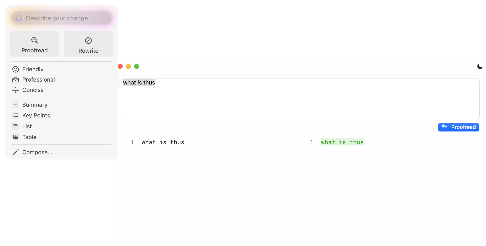

# Medio - proofread diff

Repurposing [Medio](https://github.com/nuance-dev/Medio) as a proof read diff viewer

## 📝 License

This project is licensed under the MIT License - see the [LICENSE](LICENSE) file for details.

## 🔗 Links

- Website: [Nuanc.me](https://nuanc.me)
- Report issues: [GitHub Issues](https://github.com/nuance-dev/Medio/issues)
- Follow updates: [@Nuanced](https://twitter.com/Nuancedev)
